---
## Front matter
title: "Отчёт по лабораторной работе №3"
subtitle: "Дисциплина: Архитектура компьютера"
author: "Соснина Виктория Евгеньевна"

## Generic otions
lang: ru-RU
toc-title: "Содержание"

## Bibliography
bibliography: bib/cite.bib
csl: pandoc/csl/gost-r-7-0-5-2008-numeric.csl

## Pdf output format
toc: true # Table of contents
toc-depth: 2
lof: true # List of figures
lot: true # List of tables
fontsize: 12pt
linestretch: 1.5
papersize: a4
documentclass: scrreprt
## I18n polyglossia
polyglossia-lang:
  name: russian
  options:
	- spelling=modern
	- babelshorthands=true
polyglossia-otherlangs:
  name: english
## I18n babel
babel-lang: russian
babel-otherlangs: english
## Fonts
mainfont: PT Serif
romanfont: PT Serif
sansfont: PT Sans
monofont: PT Mono
mainfontoptions: Ligatures=TeX
romanfontoptions: Ligatures=TeX
sansfontoptions: Ligatures=TeX,Scale=MatchLowercase
monofontoptions: Scale=MatchLowercase,Scale=0.9
## Biblatex
biblatex: true
biblio-style: "gost-numeric"
biblatexoptions:
  - parentracker=true
  - backend=biber
  - hyperref=auto
  - language=auto
  - autolang=other*
  - citestyle=gost-numeric
## Pandoc-crossref LaTeX customization
figureTitle: "Рис."
tableTitle: "Таблица"
listingTitle: "Листинг"
lofTitle: "Список иллюстраций"
lotTitle: "Список таблиц"
lolTitle: "Листинги"
## Misc options
indent: true
header-includes:
  - \usepackage{indentfirst}
  - \usepackage{float} # keep figures where there are in the text
  - \floatplacement{figure}{H} # keep figures where there are in the text
---

# Цель работы

Цель данной работы – получение практических навыков работы с системой
git, изучение средств контроля версий.

# Выполнение лабораторной работы

## Настройка github

Создадим учетную запись на https://github.com/

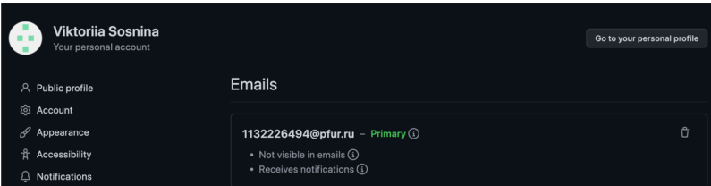{ #fig:001 width=70% }

## Базовая настройка git

Укажем имя и адрес электронной почты. Эта информация не может быть изменена и будет доступна при каждом внесенном изменении в проект. Используем для этого команды git config --global user.name и git config --global user.email. Также настроим utf-8 в выводе сообщений git с помощью команды git config --global core.quotepath false.

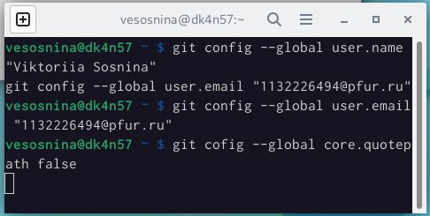{ #fig:002 width=70% }

Назовем начальную ветку master, введем параметры autocrlf и safecrlf.

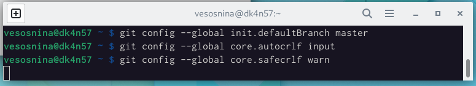{ #fig:003 width=70% }

## Создание SSH ключа

Сгенерируем приватный и открытый (public) ключи. Они необходимы для идентификации пользователя на сервере репозиториев. Используем для этого команду ssh-keygen -C. Сгенерированные ключи хранятся в каталоге ~/.ssh/. Скопируем в буфер обмена публичный ключ, получив к нему доступ с помощью команды cat.

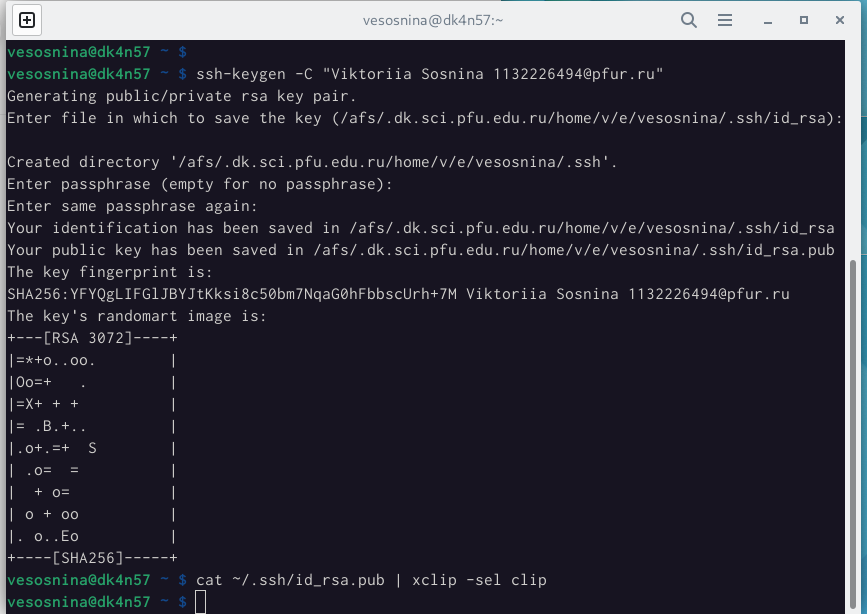{ #fig:004 width=70% }

Загрузим открытый ключ в github и зададим ему имя.

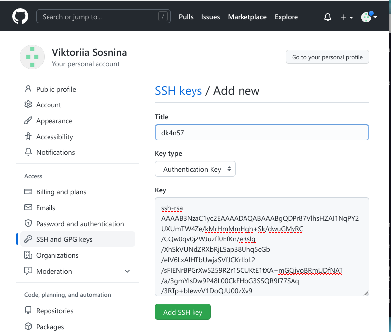{ #fig:005 width=70% }

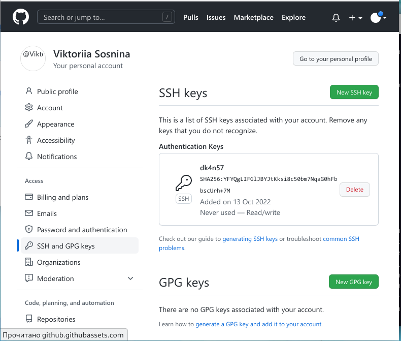{ #fig:006 width=70% }

## Сознание рабочего пространства и репозитория курса на основе шаблона

Откроем терминал и создадим каталог для дисциплины «Архитектура компьютеров», используя команду mkdir.

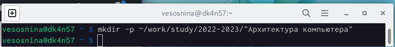{ #fig:007 width=70% }

## Сознание репозитория курса на основе шаблона

Через web-интерфейс github создадим репозиторий на основе шаблона,размещенного на странице https://github.com/yamadharma/course-directory-student-template. Используем шаблон, нажав “Use this template”. study_2022–2023_arh-pc

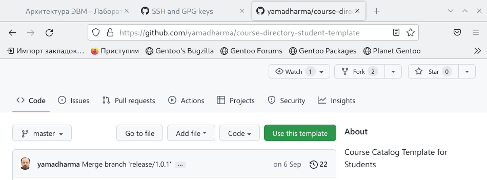{ #fig:008 width=70% }

Создадим репозиторий на основе данного шаблона и назовем его study_2022–2023_arh-pc.

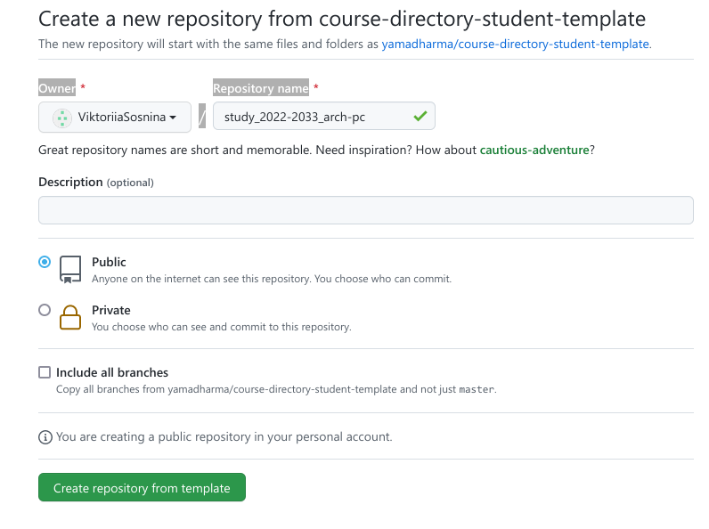{ #fig:009 width=70% }

Через терминал перейдем в созданный нами каталог курса, используя команду cd. Клонируем его в созданный репозиторий с помощью команды git clone,предварительно скопировав ссылку для клонирования.

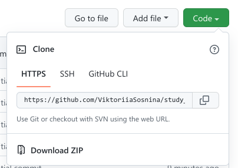{ #fig:010 width=70% }

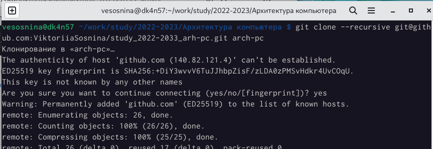{ #fig:011 width=70% }

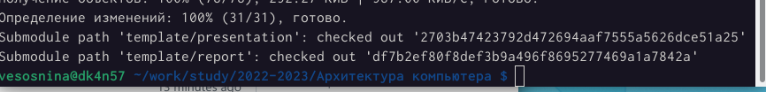{ #fig:012 width=70% }

## Настройка каталога курса

Через терминал перейдём в каталог курса, используя команду cd. Удалим лишние файлы и создадим необходимые каталоги, отправим файлы на сервер.

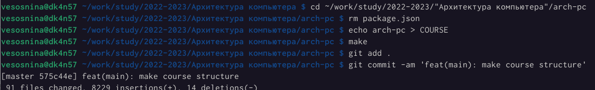{ #fig:013 width=70% }

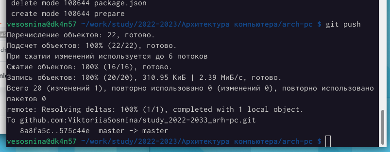{ #fig:014 width=70% }

Проверим правильность создания иерархии рабочего пространства как в локальном репозитории, так и на странице github.

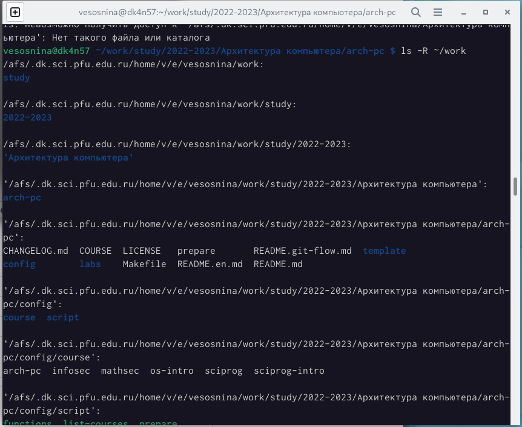{ #fig:015 width=70% }

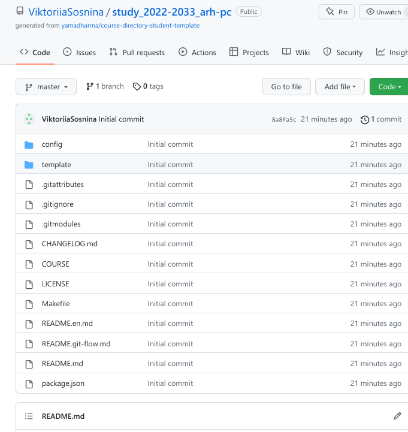{ #fig:016 width=70% }

Выполнение заданий, описанных выше, позволило нам научиться создавать учетную запись на github, выполнять базовую настройку git, создавать приватные и открытые ключи, создавать рабочее пространство репозитория, использовать существующий шаблон репозитория.

# Выполнение заданий для самостоятельной работы

Создадим отчет по выполнению текущей лабораторной работы в соответствующем каталоге рабочего пространства (labs/lab03/report).

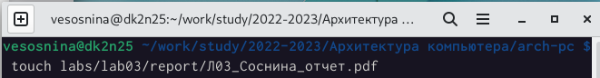{ #fig:017 width=70% }

Скопируем отчеты по выполнению предыдущих лабораторных работ в соответствующие каталоги созданного рабочего пространства.

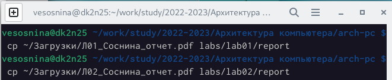{ #fig:018 width=70% }

Загрузим файлы на github, используя команды git add ., git commit, git push.

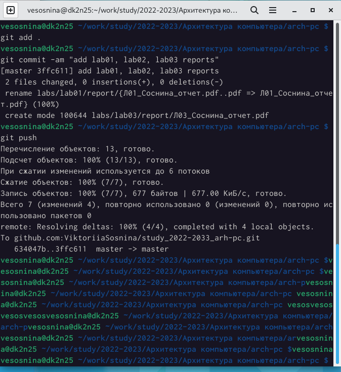{ #fig:019 width=70% }

Выполнение заданий для самостоятельной работы позволило нам научиться загружать отчеты лабораторных работ на сервер.

# Вывод

В результате выполнения лабораторной работы я получила практические навыки по работе с системой git, изучила и применила средства контроля версий, что потребуется для дальнейшей работы на курсе.

# Список литературы{.unnumbered}

::: {#refs}
:::
