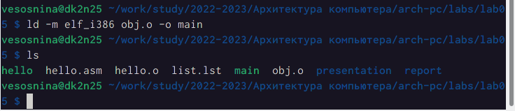
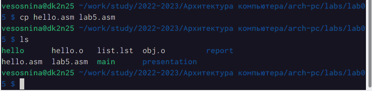

---
## Front matter
title: "Отчёт по лабораторной работе №5"
subtitle: "Дисциплина: Архитектура компьютера"
author: "Соснина Виктория Евгеньевна"

## Generic otions
lang: ru-RU
toc-title: "Содержание"

## Bibliography
bibliography: bib/cite.bib
csl: pandoc/csl/gost-r-7-0-5-2008-numeric.csl

## Pdf output format
toc: true # Table of contents
toc-depth: 2
lof: true # List of figures
lot: true # List of tables
fontsize: 12pt
linestretch: 1.5
papersize: a4
documentclass: scrreprt
## I18n polyglossia
polyglossia-lang:
  name: russian
  options:
	- spelling=modern
	- babelshorthands=true
polyglossia-otherlangs:
  name: english
## I18n babel
babel-lang: russian
babel-otherlangs: english
## Fonts
mainfont: PT Serif
romanfont: PT Serif
sansfont: PT Sans
monofont: PT Mono
mainfontoptions: Ligatures=TeX
romanfontoptions: Ligatures=TeX
sansfontoptions: Ligatures=TeX,Scale=MatchLowercase
monofontoptions: Scale=MatchLowercase,Scale=0.9
## Biblatex
biblatex: true
biblio-style: "gost-numeric"
biblatexoptions:
  - parentracker=true
  - backend=biber
  - hyperref=auto
  - language=auto
  - autolang=other*
  - citestyle=gost-numeric
## Pandoc-crossref LaTeX customization
figureTitle: "Рис."
tableTitle: "Таблица"
listingTitle: "Листинг"
lofTitle: "Список иллюстраций"
lotTitle: "Список таблиц"
lolTitle: "Листинги"
## Misc options
indent: true
header-includes:
  - \usepackage{indentfirst}
  - \usepackage{float} # keep figures where there are in the text
  - \floatplacement{figure}{H} # keep figures where there are in the text
---

# Цель работы

Цель данной раюоты --- изучение основ процедур комплиляции и сборки программ, написанных на ассемблере NASM.

# Выполнение лабораторной работы

Перейдем каталог текущей лабораторной работы. Используя команду  touch, создадим текстовый файл hello.asm и откроем его с помощью текстового редактора gedit.

{ #fig:001 width=70% }

{ #fig:002 width=70% }

Введем программу, которая выведет текст "Hello world!".

{ #fig:003 width=70% }

Создадим объектный код, то есть скомпилируем текст программмы, которую мы написали ранее. Для этого используем команду nasm -f elf hello.asm

{ #fig:004 width=70% }

Скомпилируем файл hello.asm в obj.o и создадим файл листинга list.lst

{ #fig:005 width=70% }

Передадим объектный файл hello.o на обработку компоновщику. Получим при этом исполняемый файл hello. Введем для этого команду ld -m elf_i386 hello.o -o hello. Проверим правильность выполненных действий командой ls.

{ #fig:006 width=70% }

Тперь передадим объектный файл obj.o на обработку компоновщику. Получим при этом исполняемый файл main. Введем для этого команду ld -m elf_i386 obj.o -o main. Проверим правильность выполненных действий командой ls.

{ #fig:007 width=70% }

Запустим созданный ранее исполняемый файл hello. Введем для этого команду ./hello

{ #fig:008 width=70% }

Выполнение даннных заданий позволило мне ознакомиться с процедурой компиляции и сборки программ на ассемблере NASM.

# Выполнение заданий для самостоятельной работы

Скопируем файл hello.asm и зададим ему имя lab5.asm

{ #fig:009 width=70% }

Отредактируем файл так, чтобы программа выводила имя и фамилию.

{ #fig:010 width=70% }

Оттранслируем lab5.asm в объектный файл и создадим файл листинга. Используем для этого команду nasm -o obj_lab5.o elf -g -l list_lab5.lst lab5.asm.

{ #fig:011 width=70% }

Выполним компановку полученного объектного файла. Введем для этого команду ld -m elf_i386 obj_lab5.o -o lab5_uwu

{ #fig:012 width=70% }

Запустим исполняемый файл lab5_uwu. Введем для этого команду ./lab5_uwu

{ #fig:013 width=70% }

Выполнение заданий для самостоятельной работы позволило мне на практике применить полученные знания по компиляции и сборке программ на ассемблере NASM.

# Выводы

В результате выполнения лабораторной работы я освоила процедуру компиляции и сборки программ, написанных на ассемблере NASM. Полученные знания позволят мне писать более сложные программы в будущем.

# Список литературы{.unnumbered}

::: {#refs}
:::
